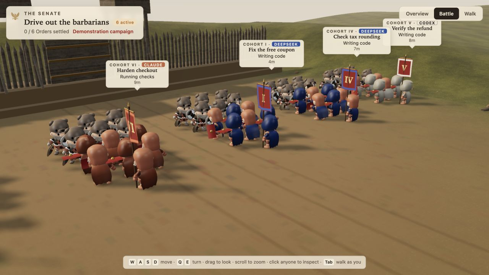

# Audit grafica 3D e battaglia — 2 ottobre 2026

Direzione scelta: cinema romano, con schieramenti, polvere, impatti e stendardi. La scena mantiene lo stile KayKit esistente e rappresenta lo stato reale degli Order; non introduce danni, progressi o vittorie simulati.

## Risultato visivo

- Medium/High: ogni Cohort passa da un portastendardo e tre legionari contro tre barbari a un portastendardo e sei legionari contro sei barbari. Due ranghi, attacchi e risposte alternati, piccoli avanzamenti e rinculi, retrovia con scudi alzati. Low mantiene tre combattenti per parte.
- Stendardi più leggibili, tessuto suddiviso con movimento al vento sulla GPU e bordo superiore fissato alla traversa.
- Polvere di marcia e d'impatto, scintille brevi sui colpi. I checks mostrano impatti difensivi; Order blocked, failed, reading o in review non combattono.
- Terreno più dettagliato, solchi di carri, rinforzi di legno e bronzo sul forte, rocce e pali rotti ai lati del campo.
- Comando **Battle** per avvicinarsi allo scontro; **Overview** ripristina l'inquadratura del campus. Fixture `battle` con sei Cohort, inclusa una impegnata nei checks.



## Problemi trovati e corretti

| Problema | Intervento |
| --- | --- |
| Sei parti skinned compatibili per corpo, con draw e skeleton duplicati | Fusione prima del cloning, conservando pesi e bind transform. Parti incompatibili, morph e parti animate direttamente restano separate; ogni figura mantiene ossa indipendenti. |
| Gladius e scutum divisi in più mesh | Una mesh per arma, attributi di colore, metalness e roughness conservano acciaio, bronzo, legno e pittura. |
| Materiali di dissolvenza e puff creati ripetutamente | Materiali condivisi per figura; due pool instanced globali con capacità fissa, riuso dei buffer e scarto dell'eccesso. Nessuna crescita delle risorse GPU per impatto. |
| Skeleton, geometrie temporanee e risorse PMREM trattenuti | Rilascio di mixer, materiali della figura, bone texture, standard, geometrie temporanee e risorse di generazione ambiente. |
| Antialiasing sul canvas, invece che sui target usati dal composer | Multisampling sui render target effettivi; AO a mezza risoluzione su High, senza particelle nel pass delle normali. |
| Ombre ripetute nei pass e copertura limitata al campus | Aggiornamento unico condiviso e area solare estesa al campo; Low aggiorna le ombre a 30 Hz. |
| Trasformazioni dell'intera gerarchia ripetute nei pass | Aggiornamento esplicito una volta per frame, riutilizzato da colore, normali, profondità e label. |
| Pose complete anche per retrovie e figure lontane | Pose a 24 Hz per retrovie e field oltre 36 m; tempo frazionario conservato. Fronti vicini, marcia e cambio di stato restano immediati; `cine=1` e `tour=1` mantengono tutte le pose a cadenza piena. |
| DPR elevato anche sotto carico persistente | Tier automatici e budget di risoluzione con isteresi: cala dopo rallentamento sostenuto, recupera con margine stabile. Qualità esplicita e catture manuali non si adattano. |

## Misure comparabili

Browser WebGL locale, viewport 1280 × 800, DPR 1, High, stessa camera e stesso stato della fixture. Baseline copiata prima degli interventi; per il campo pieno, solo la fixture dei sei Order è stata aggiunta alla baseline. 150 avanzamenti a 1/30 s: 30 di riscaldamento, 120 campioni. `gl.finish()` incluso nel tempo; il campione finale include tutti i pass e le ombre.

| Una Cohort, camera vicina | Prima | Dopo | Variazione |
| --- | ---: | ---: | ---: |
| Figure, portastendardo incluso | 7 | 13 | +86% |
| Draw call | 652 | 392 | −40% |
| Triangoli renderizzati | 702.202 | 558.692 | −20% |
| Texture residenti conteggiate da Three | 101 | 56 | −45% |
| Tempo mediano sincronizzato | 3,4 ms | 2,7 ms | −21% |
| Tempo p95 sincronizzato | 4,2 ms | 3,0 ms | −29% |

| Sei Cohort, campo pieno | Prima | Dopo | Variazione |
| --- | ---: | ---: | ---: |
| Figure, portastendardi inclusi | 42 | 78 | +86% |
| Draw call | 1.966 | 1.429 | −27% |
| Triangoli renderizzati | 1.417.446 | 1.682.375 | +19% |
| Texture residenti conteggiate da Three | 316 | 126 | −60% |
| Tempo mediano sincronizzato | 10,4 ms | 11,6 ms | +12% |
| Tempo p95 sincronizzato | 11,4 ms | 12,9 ms | +13% |

**Limite misurato:** High con il campo pieno costa ancora di più in tempo frame, pur usando meno draw e texture: quasi raddoppia le figure e aggiunge effetti. Medium evita il pass AO; Low riduce anche figure, risoluzione, ombre e capacità delle particelle. Nessuna promessa universale di FPS.

I tempi includono avanzamento della scena, invio dei comandi e attesa della GPU. Non sono query temporali GPU isolate e non includono la composizione completa del browser. Il valore `fps` nei JSON manuali non rappresenta la frequenza reale. Il conteggio delle texture non misura byte VRAM. La prova a 390 × 844 verifica il layout e il tier Low su questa macchina, non le prestazioni di un telefono fisico.

Low finale, una Cohort a 390 × 844 e DPR 1: 229 draw call, 33 texture, mediana 1,8 ms e p95 2,2 ms. È una misura del tier ridotto, non un confronto con un telefono o con High alla stessa risoluzione.

## Ripetibilità ed evidenze

I JSON e screenshot si trovano in [evidence/world-3d-2026-10-02](evidence/world-3d-2026-10-02/). `before-desktop.json` e `after-desktop.json` sono il confronto vicino; `before-stress-high.json` e `after-stress-high.json` il campo pieno.

Il probe [benchmark.js](evidence/world-3d-2026-10-02/benchmark.js) va aggiunto **solo a una copia isolata** in fondo a `js/main.js`, dopo l'avvio. Servire la copia via HTTP locale e usare:

```text
?demo=one&quality=high&manual=1&audit=1&cam=-63,8,8,-77,1,-3.5
?demo=battle&quality=high&manual=1&audit=1&cam=-51,22,33,-81,1,0
```

Leggere il JSON da `#audit-results`. Il probe chiama `gl.finish()` apposta e non fa parte dell'app distribuita. Per osservare la scena dal vivo usare `?demo=battle&perf=1` e selezionare **Battle**; `?quality=low|medium|high` consente confronti a qualità fissa. `?perf=1` mostra FPS, tempo CPU, draw call, DPR e tier.

## Verifica

- `node --experimental-vm-modules tests/world_render.mjs`: qualità e recupero del DPR, 10.000 emissioni senza crescita dei pool, fusione reale dei corpi e indipendenza delle ossa clonate, cadenza delle pose, combattimento/guardia e rientro delle Cohort.
- `node --experimental-vm-modules tests/world_ui.mjs`: richieste coalescenti, risposte obsolete, Order rimossi, invio Consul e conservazione dei draft.
- Browser: Overview e Battle, schieramenti Medium/High, tier Low e layout stretto; nessun errore o warning WebGL registrato.
- Prima del push: test JS e camera Battle verificati anche sul frontend 3D isolato, con ingresso diretto da `js/main.js`, senza dipendenze dal prototipo 2D. Fmt e clippy ripetuti sul checkout corrente.
- `cargo fmt --check` e `cargo clippy`: passati sul checkout condiviso. `cargo test` compila, ma il nuovo test `app::mission_drive::tests::drive_runs_a_bounded_parallel_wave_and_reuses_policy_after_reopen` fallisce con `EventTimestampRegression`: 1.150 unit test passati, uno fallito; errore confermato anche eseguendo il test da solo. Il fallimento riguarda il lavoro backend concorrente.
- Snapshot isolato della base `cbcdef74e75b36893ba254c0d2d559901dad7475` con `world/`, test JS e documentazione World aggiornati: `cargo fmt --check`, `cargo clippy --offline` e suite `cargo test --offline -- --test-threads=1` passati, 1.118 unit test e 81 test d'integrazione, più tre test nativi già marcati ignored dal progetto. Simboli debug e incremental compilation disabilitati per limitare l'uso del disco; nessun test viene escluso tramite filtri. I primi tentativi con la cache ordinaria erano stati fermati da `No space left on device`; è stata pulita solo cache Cargo rigenerabile.

La feature map [world.md](../features/world.md) descrive controlli, tier, percorsi e test aggiornati. Le modifiche backend e l'esperimento 2D presenti nel checkout provengono da lavoro concorrente; questo audit riguarda rendering 3D e battaglia.
